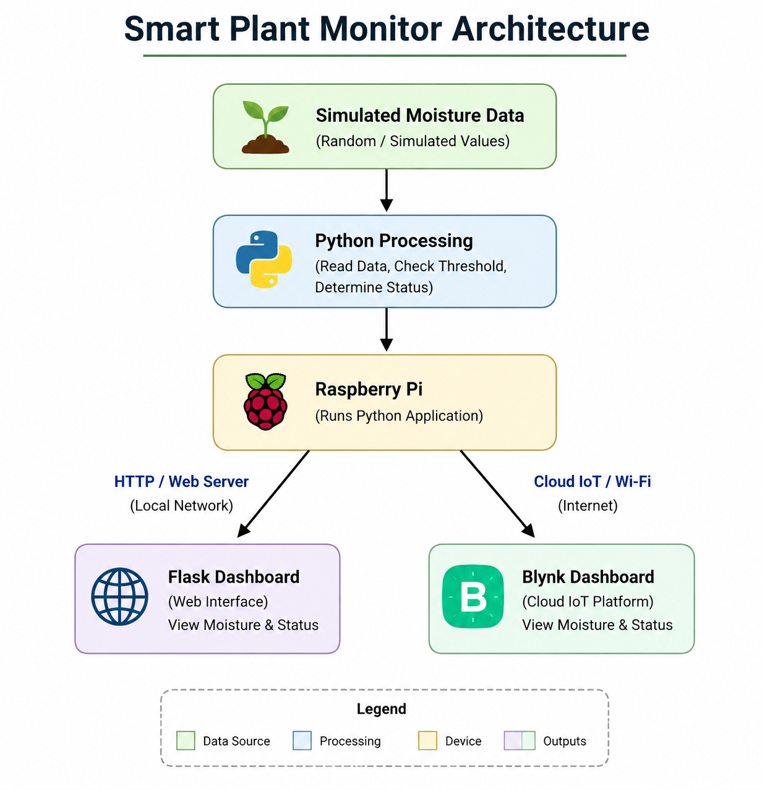
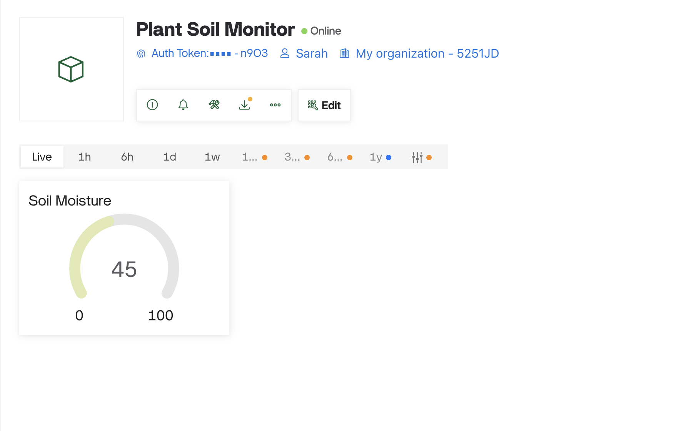

# ConnectedApp

#### Student Name: *Sarah Jameson*   Student ID: *20118734*

This project is an IoT-based Smart Plant Monitoring System developed using a Raspberry Pi, Flask and Blynk.

The system simulates soil moisture readings and displays them on both a Flask web dashboard and a Blynk IoT dashboard. Threshold logic is used to determine whether the plant requires watering.

The project demonstrates IoT concepts including networking, cloud communication, Python processing, web technologies and dashboard visualisation.

## Tools, Technologies and Equipment

- Raspberry Pi
- Python programming language
- HTTP
- JSON
- Flask
- CSV
- Visual Studio Code
- Git and GitHub
- HTML and CSS
- Blynk

## System Architecture

## Flask Dashboard

## Blynk Dashboard

## How to Run

1. Clone/download the repository
2. Install dependencies: `pip install -r requirements.txt`
3. Set the Blynk authentication token as an environment variable
4. Run: `python3 app.py`
5. Open the Flask dashboard in a browser

## Sensor Information

A capacitive soil moisture sensor was selected as the intended physical input device. However, because the Raspberry Pi does not include built-in analog input support, an ADC such as the MCP3008 is required to read the sensor accurately.

Due to hardware limitations before the submission deadline, simulated moisture values were used while maintaining the intended IoT architecture and dashboard functionality.

## Future Improvements

- Real sensor integration using MCP3008
- Automatic watering system
- Database storage
- Historical moisture graphs
- Mobile notifications

